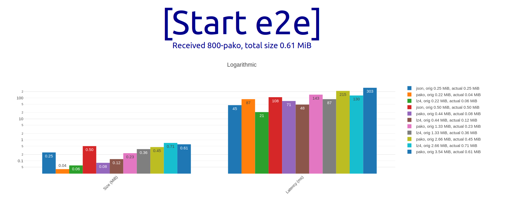

# End-to-end metrology compression benchmark

React based end-to-end metrology compression benchmark for large data

Based on [shared-property-map](https://github.com/dstanesc/shared-property-map) testing tool

## Azure env setup
```
export FLUID_MODE=frs
export SECRET_FLUID_RELAY=https://us.fluidrelay.azure.com
export SECRET_FLUID_TOKEN=xyz
export SECRET_FLUID_TENANT=xyz
```

## Local env setup

```
export FLUID_MODE=tiny
```

## Start

```
npx tinylicious
```

```
npm run clean
npm install
npm run build
npm start
```

## My Results

Local (Tinylicious)



Remote (FRS)


