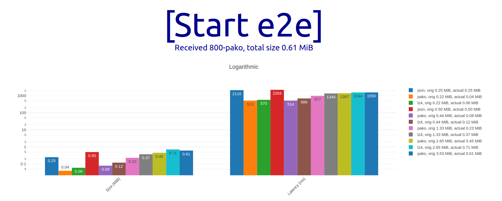

# End-to-end metrology compression benchmark

React based, metrology compression benefits benchmark for larger data. Evaluating the end-to-end latency associated w/ the operation roundtrip, for both local (ie. [Tinylicious](https://github.com/microsoft/FluidFramework/tree/main/server/tinylicious)) and remote (ie. [Fluid](https://docs.microsoft.com/en-us/azure/azure-fluid-relay/)) relay services.

Based on [synthetic metrology data](https://github.com/dstanesc/fake-metrology-data) and [shared-property-map](https://github.com/dstanesc/shared-property-map) libraries

## Fluid Relay Env Setup
```
export FLUID_MODE=frs
export SECRET_FLUID_RELAY=https://us.fluidrelay.azure.com
export SECRET_FLUID_TOKEN=xyz
export SECRET_FLUID_TENANT=xyz
```

## Tinylicious Env Setup

```
export FLUID_MODE=tiny
```

## Start

When using local relay, start the `tinylicious` service

```
npx tinylicious
```


```
npm run clean // optional
npm install
npm run build
npm start
```

## Example Results

Local (Tinylicious)


Remote (FRS)


